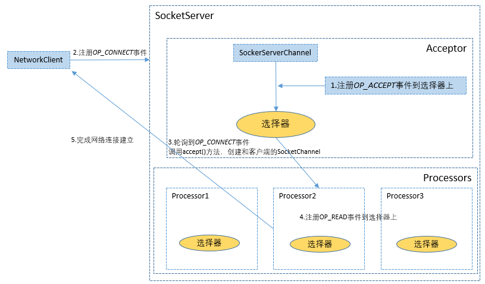
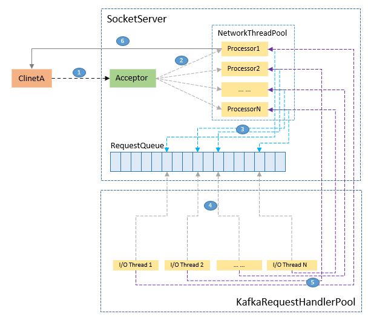

# 大纲
1. Kafka 是怎样应用Java NIO来实现高效网络通信
2. Kafka 网络通信架构及请求处理流程


## Kafka是怎样应用Java NIO来实现网络通信的

从上述流程图可以看出，这里涉及两个关键对象：Acceptor和Processor

### Acceptor
Acceptor 线程使用 Java NIO 的 Selector + SocketChannel 的方式循环地轮询准备就绪的 I/O 事件。这里的 I/O 事件，主要是指网络连接创建事件，即代码中的 SelectionKey.OP_ACCEPT。一旦接收到外部连接请求，Acceptor 就会指定一个 Processor 线程，并将该请求交由它，让它创建真正的网络连接, 一个Broker可以创建多个Acceptor，这里Acceptor和Endpoint一一对应，受服务启动参数`listeners`控制(例如FI Kafka启动参数`listeners=SASL_PLAINTEXT:`) 

下面来以FI的两个版本Kafka在实现Reactor模型时，遇到的问题，以及是如何优化的
#### FI C80 Kafka内核Reactor模型实现细节(kafka-0.11.0.1)
首先来看Acceptor的构造方法，主要成员是：
1. 其绑定的Endpoint(可以理解为端口), 
2. 处理连接请求及response的线程池
2. 连接限制器
```java
/**
 * Thread that accepts and configures new connections. There is one of these per endpoint.
 */
private[kafka] class Acceptor(val endPoint: EndPoint,  // 监听器名
                              // SocketOptions 的 SO_SNDBUF，即用于设置出站（Outbound）网络 I/O 的底层缓冲区大小。该值默认是 Broker 端参数 socket.send.buffer.bytes 的值，即 100KB
                              val sendBufferSize: Int, // 
                              // SocketOptions 的 SO_RCVBUF，即用于设置入站（Inbound）网络 I/O 的底层缓冲区大小。该值默认是 Broker 端参数 socket.receive.buffer.bytes 的值，即 100KB
                              val recvBufferSize: Int,
                              brokerId: Int,
                              processors: Array[Processor], // 处理request和response的线程池
                              connectionQuotas: ConnectionQuotas // 连接限制器
                              ) extends AbstractServerThread(connectionQuotas) with KafkaMetricsGroup {
  // selector
  private val nioSelector = NSelector.open()
  // ServerSocketChannel
  val serverChannel = openServerSocket(endPoint.host, endPoint.port)
```
接下来再来看Acceptor是如何将新建连接请求下发到Processor的
```java
// C80 Kafka(0.11.0) Acceptor#run()
/**
  * Accept loop that checks for new connection attempts
  */
def run() {
  serverChannel.register(nioSelector, SelectionKey.OP_ACCEPT)
  startupComplete()
  try {
    var currentProcessor = 0
    while (isRunning) {
      try {
        // 选择器每500ms获取一次I/O就绪事件
        val ready = nioSelector.select(500)
        if (ready > 0) {
          val keys = nioSelector.selectedKeys()
          val iter = keys.iterator()
          while (iter.hasNext && isRunning) {
            try {
              val key = iter.next
              iter.remove()
              if (key.isAcceptable)
                // 以轮询方式,将新建连接请求下发到processor
                accept(key, processors(currentProcessor))
              else
                throw new IllegalStateException("Unrecognized key state for acceptor thread.")

              // round robin to the next processor thread
              currentProcessor = (currentProcessor + 1) % processors.length
            } catch {
              case e: Throwable => error("Error while accepting connection", e)
            }
          }
        }
      }

// Acceptor#accept()
/*
  * Accept a new connection
  */
def accept(key: SelectionKey, processor: Processor) {
  val serverSocketChannel = key.channel().asInstanceOf[ServerSocketChannel]
  val socketChannel = serverSocketChannel.accept()
  try {
    connectionQuotas.inc(socketChannel.socket().getInetAddress)
    socketChannel.configureBlocking(false)
    socketChannel.socket().setTcpNoDelay(true)
    socketChannel.socket().setKeepAlive(true)
    if (sendBufferSize != Selectable.USE_DEFAULT_BUFFER_SIZE)
      socketChannel.socket().setSendBufferSize(sendBufferSize)

    debug("Accepted connection from %s on %s and assigned it to processor %d, sendBufferSize [actual|requested]: [%d|%d] recvBufferSize [actual|requested]: [%d|%d]"
          .format(socketChannel.socket.getRemoteSocketAddress, socketChannel.socket.getLocalSocketAddress, processor.id,
                socketChannel.socket.getSendBufferSize, sendBufferSize,
                socketChannel.socket.getReceiveBufferSize, recvBufferSize))

    // 调用processor的accept方法，将新建连接的socketChannel添加到processor的队列之中
    processor.accept(socketChannel)
  } catch {
    case e: TooManyConnectionsException =>
      info("Rejected connection from %s, address already has the configured maximum of %d connections.".format(e.ip, e.count))
      close(socketChannel)
  }
}

// Processor#accept()
/**
  * Queue up a new connection for reading
  */
// newConnections是个无长度限制、非阻塞的队列
// private val newConnections = new ConcurrentLinkedQueue[SocketChannel]()
def accept(socketChannel: SocketChannel) {
  // 非阻塞方法，直接将新建socketChannel添加到队列中
  newConnections.add(socketChannel)
  wakeup()
}
```
### Processor
上文提到，Acceptor采用轮询方式来把客户端的SocketChannle分配给Processor，所以Processor的一个职责是真正建立与客户端或其他Broker的连接；显然除此之外Processor做的事情要远比Acceptor多得多，这点可以通过Processor#run()看出来
```java
  override def run(): Unit = {
    startupComplete()
    try {
      while (isRunning) {
        try {
          // 新建连接
          configureNewConnections()
          // 发送response,并将response添加到inFlight队列中
          processNewResponses()
          // 真正执行I/O操作
          poll()
          // 处理SocketChannel中接收到的请求,并将其添加到RequestChannel的RequestQueue中
          processCompletedReceives()
          // 为发送成功的Response执行回调逻辑
          processCompletedSends()
          // 处理断开的连接
          processDisconnected()
          // 进行连接控制，断开超过配额的连接
          closeExcessConnections()
        } catch {
          case e: Throwable => processException("Processor got uncaught exception.", e)
        }
      }
```
这样实现是否存在问题？ 我们一起来看下 configuraNewConnections() 方法就知道了
```java
  /**
   * Register any new connections that have been queued up
   */
  private def configureNewConnections() {
    // 只要队列不为空，则将SocketChannel注册到selector的OP_READ事件上
    while (!newConnections.isEmpty) {
      val channel = newConnections.poll()
      try {
        debug(s"Processor $id listening to new connection from ${channel.socket.getRemoteSocketAddress}")
        val localHost = channel.socket().getLocalAddress.getHostAddress
        val localPort = channel.socket().getLocalPort
        val remoteHost = channel.socket().getInetAddress.getHostAddress
        val remotePort = channel.socket().getPort
        val connectionId = ConnectionId(localHost, localPort, remoteHost, remotePort).toString
        selector.register(connectionId, channel)
      } catch {
        // We explicitly catch all non fatal exceptions and close the socket to avoid a socket leak. The other
        // throwables will be caught in processor and logged as uncaught exceptions.
        case NonFatal(e) =>
          val remoteAddress = channel.getRemoteAddress
          // need to close the channel here to avoid a socket leak.
          close(channel)
          error(s"Processor $id closed connection from $remoteAddress", e)
      }
    }
  }
```
这里Processor的newConnections队列是非阻塞、长度无限的队列，如果服务端收到DDOS攻击，新建连接请求将会耗尽服务端的CPU、内存资源，对服务造成致命影响.

```java
// Kafka 0.11.0 版本 (FI C80)
// Processor#configureNewConnections()

/**
  * Register any new connections that have been queued up
  */
private def configureNewConnections() {
  while (!newConnections.isEmpty) {
    // 从新建连接请求队列中取出新建连接请求，如果队列为空，则返回null(非阻塞)
    // newConnections = new ArrayBlockingQueue[SocketChannel](connectionQueueSize), 默认大小为
    val channel = newConnections.poll()
    try {
      debug(s"Processor $id listening to new connection from ${channel.socket.getRemoteSocketAddress}")
      val localHost = channel.socket().getLocalAddress.getHostAddress
      val localPort = channel.socket().getLocalPort
      val remoteHost = channel.socket().getInetAddress.getHostAddress
      val remotePort = channel.socket().getPort
      val connectionId = ConnectionId(localHost, localPort, remoteHost, remotePort).toString
      selector.register(connectionId, channel)
    } catch {
      // We explicitly catch all non fatal exceptions and close the socket to avoid a socket leak. The other
      // throwables will be caught in processor and logged as uncaught exceptions.
      case NonFatal(e) =>
        val remoteAddress = channel.getRemoteAddress
        // need to close the channel here to avoid a socket leak.
        close(channel)
        error(s"Processor $id closed connection from $remoteAddress", e)
    }
  }
}
这样的实现在遇到DDOS情况下，将会给Broker带来灾难，会耗尽主机上的资源，甚至导致服务不可用

````


## Kafka网络通信架构及请求处理流程



#### FI 651 Kafka内核Reactor模式实现细节(kafka-1.1.0)
```java
/**
 * Thread that accepts and configures new connections. There is one of these per endpoint.
 */
private[kafka] class Acceptor(val endPoint: EndPoint,   // 每个endpoint都会创建对应的Acceptor
                              // SocketOptions 的 SO_SNDBUF，即用于设置出站（Outbound）网络 I/O 的底层缓冲区大小。该值默认是 Broker 端参数 socket.send.buffer.bytes 的值，即 100KB
                              val sendBufferSize: Int,
                              // SocketOptions 的 SO_RCVBUF，即用于设置入站（Inbound）网络 I/O 的底层缓冲区大小。该值默认是 Broker 端参数 socket.receive.buffer.bytes 的值，即 100KB
                              val recvBufferSize: Int,
                              brokerId: Int,
                              // 连接数限制器
                              connectionQuotas: ConnectionQuotas,
                              metricPrefix: String) extends AbstractServerThread(connectionQuotas) with KafkaMetricsGroup {

  private val nioSelector = NSelector.open()
  // 创建Server Socket Channel, 后面会注册到选择器的OP_ACCEPT事件上
  val serverChannel = openServerSocket(endPoint.host, endPoint.port)
  // Processor线程池,每个Acceptor配备的Processor个数受 num.network.threads 参数控制, 默认是3
  private val processors = new ArrayBuffer[Processor]()
  private val processorsStarted = new AtomicBoolean
  // 监控指标采集器
  private val blockedPercentMeter = newMeter(s"${metricPrefix}AcceptorBlockedPercent",
    "blocked time", TimeUnit.NANOSECONDS, Map(ListenerMetricTag -> endPoint.listenerName.value))
```
```java
// Acceptor.run()
// 它是处理 Reactor 模式中分发逻辑的主要实现方法
def run(): Unit = {
    // 注册OP_ACCEPT事件
    serverChannel.register(nioSelector, SelectionKey.OP_ACCEPT) startupComplete() try {
      var currentProcessorIndex = 0
      while (isRunning) {
        try {

          val ready = nioSelector.select(500)
          if (ready > 0) {
            val keys = nioSelector.selectedKeys()
            val iter = keys.iterator()
            while (iter.hasNext && isRunning) {
              try {
                val key = iter.next
                iter.remove()

                if (key.isAcceptable) {
                  // OP_ACCEPT事件发生，获取注册到选择键上的ServerSocketChannel，
                  // 然后调用其accept方法，建立一个客户端和服务端的连接通道
                  accept(key).foreach { socketChannel =>

                    // Assign the channel to the next processor (using round-robin) to which the
                    // channel can be added without blocking. If newConnections queue is full on
                    // all processors, block until the last one is able to accept a connection.
                    var retriesLeft = synchronized(processors.length)
                    var processor: Processor = null
                    do {
                      retriesLeft -= 1
                      processor = synchronized {
                        // adjust the index (if necessary) and retrieve the processor atomically for
                        // correct behaviour in case the number of processors is reduced dynamically
                        currentProcessorIndex = currentProcessorIndex % processors.length
                        processors(currentProcessorIndex)
                      }
                      currentProcessorIndex += 1
                      // 使用轮询方式选取Processor来处理新建连接，直到最后一个Processor才选用阻塞模式
                    } while (!assignNewConnection(socketChannel, processor, retriesLeft == 0))
                  }
                } else
                  throw new IllegalStateException("Unrecognized key state for acceptor thread.")
              } catch {
                case e: Throwable => error("Error while accepting connection", e)
              }
            }
          }
        }
        catch {
          // We catch all the throwables to prevent the acceptor thread from exiting on exceptions due
          // to a select operation on a specific channel or a bad request. We don't want
          // the broker to stop responding to requests from other clients in these scenarios.
          case e: ControlThrowable => throw e
          case e: Throwable => error("Error occurred", e)
        }
      }
  }
```
